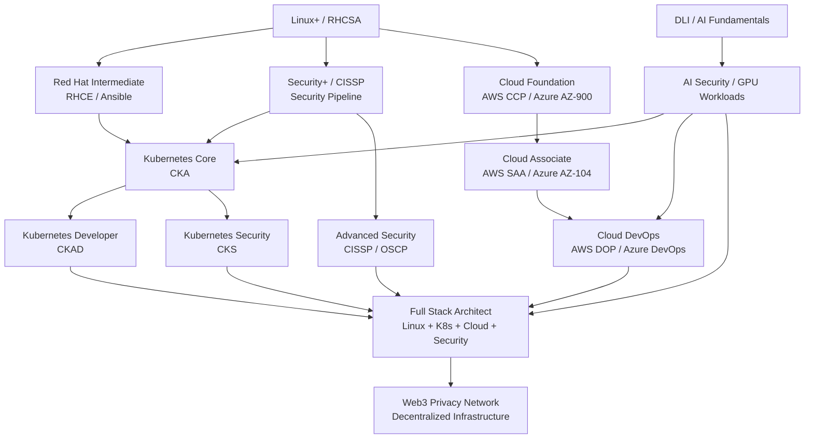

# Certification Roadmap

## Mermaid Diagram

## How to Read This Diagram

| Layer | What it means | Certs in this layer |
|-------|---------------|---------------------|
| **Foundation** | Non‑negotiable base | Linux+, RHCSA, Security+, Cloud CCP |
| **Intermediate** | Automation + orchestration | RHCE, CKA, AWS SAA |
| **Advanced** | Depth in one or more areas | CKAD, CKS, CISSP, OSCP, DevOps certs |
| **AI/GPU Pipeline** | Optional but powerful | DLI, AI security |
| **Convergence** | Where the stacks meet | None — this is **you** after stacking |
| **Final Goal** | Your Web3 privacy network | Built by you, not a cert |

## Progress Tracking

- [ ] Linux+ / RHCSA (Foundation)
- [ ] Red Hat Intermediate (RHCE / Ansible)
- [ ] Security+ / CISSP
- [ ] Cloud Foundation (AWS CCP / Azure AZ-900)
- [ ] Kubernetes Core (CKA)
- [ ] Cloud Associate (AWS SAA / Azure AZ-104)
- [ ] Kubernetes Developer (CKAD)
- [ ] Kubernetes Security (CKS)
- [ ] Cloud DevOps (AWS DOP / Azure DevOps)
- [ ] Advanced Security (CISSP / OSCP)
- [ ] DLI / AI Fundamentals
- [ ] AI Security / GPU Workloads

## Final Goal

- [ ] Web3 Privacy Network (Decentralized Infrastructure)

## Last Updated

May 2026
