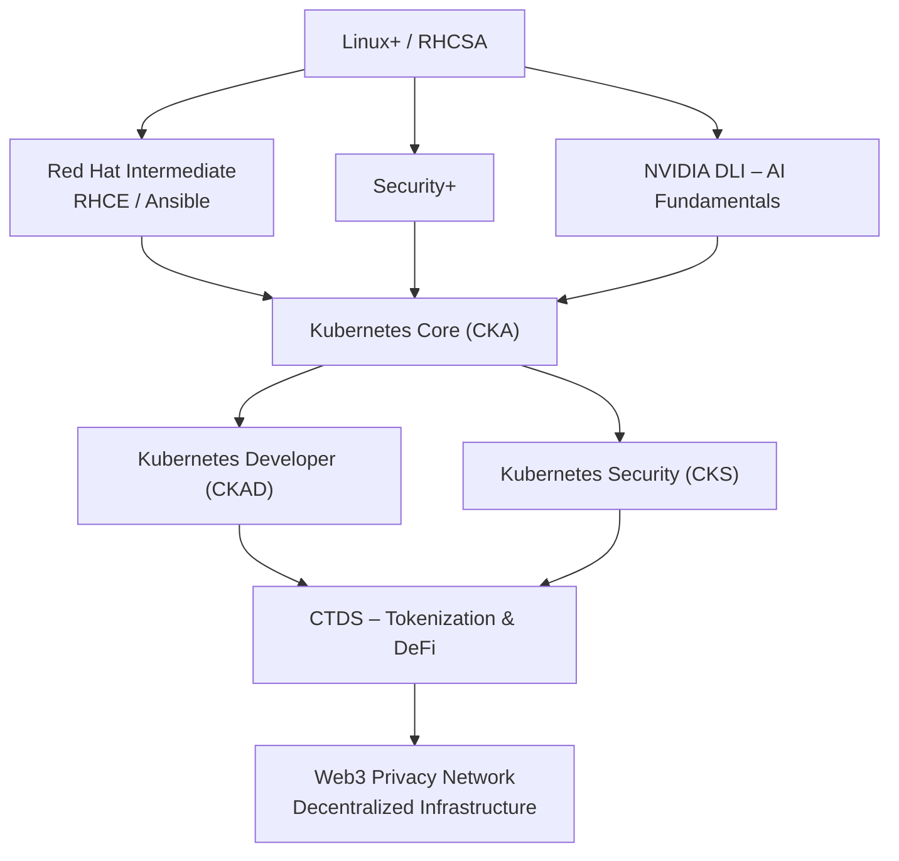

# Certification Roadmap

## Mermaid Diagram

## Core Certifications (Immediate Focus)

- [ ] **Linux+ / RHCSA** – Linux system administration foundation
- [ ] **Red Hat Intermediate (RHCE / Ansible)** – Automation for node deployment
- [ ] **Security+** – Core security principles for private network
- [ ] **Kubernetes Core (CKA)** – Orchestration for AI backend
- [ ] **Kubernetes Developer (CKAD)** – Deploying AI services on K8s
- [ ] **Kubernetes Security (CKS)** – Securing the container platform
- [ ] **NVIDIA DLI – AI Fundamentals** – Privacy‑preserving AI (Diffprivlib, ART)
- [ ] **CTDS – Tokenization & DeFi** – Core tokenomics design

## Optional / Later (Low Priority for Now)

- [ ] Cloud Foundation (AWS CCP / Azure AZ-900)
- [ ] Cloud Associate (AWS SAA / Azure AZ-104)
- [ ] Cloud DevOps (AWS DOP / Azure DevOps)
- [ ] CISSP / OSCP (long‑term security goals)
- [ ] CBA (Chartered Blockchain Analyst)
- [ ] CDAA (Chartered Digital Asset Analyst)
- [ ] CDAV (Certified Digital Asset Valuator)

## Progress Tracking

- [ ] Linux+ / RHCSA
- [ ] Red Hat Intermediate
- [ ] Security+
- [ ] Kubernetes Core (CKA)
- [ ] NVIDIA DLI
- [ ] CTDS
- [ ] Kubernetes Developer (CKAD)
- [ ] Kubernetes Security (CKS)

## Final Goal

- [ ] Web3 Privacy Network (Decentralized Infrastructure)
