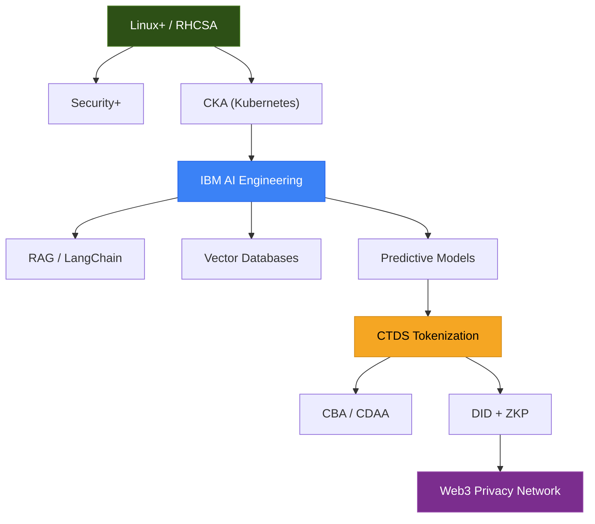

# AgNetworking Certification Roadmap (Updated)

## Mermaid Diagram

## Progress Tracking

### Phase 1: Core Infrastructure
- [ ] Linux+ / RHCSA
- [ ] Security+
- [ ] CKA (Kubernetes)

### Phase 2: AI Engineering (You are here)
- [x] IBM SkillsBuild RAG Badge
- [ ] IBM AI Engineering Professional Certificate (In progress)

### Phase 3: Tokenomics and Identity
- [ ] CTDS – Tokenization and DeFi
- [ ] CBA / CDAA
- [ ] DID + ZKP Implementation

### Final Goal
- [ ] Web3 Privacy Network (Decentralized Infrastructure)

## Last Updated
May 2026
